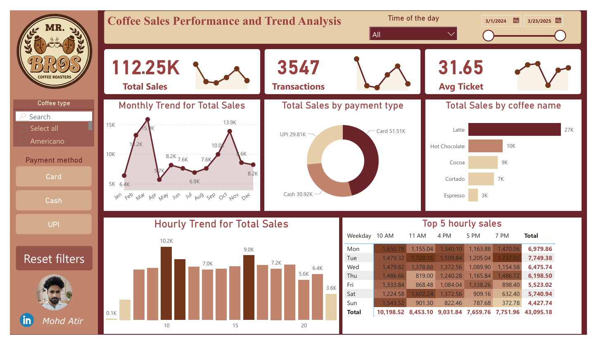

# ☕ Coffee Sales Performance and Trend Analysis

> A comprehensive Power BI analytics dashboard designed to track and analyze coffee shop sales metrics, providing actionable business intelligence for operational decision-making, marketing optimization, and revenue analysis.



---

## 📋 Overview

This Power BI dashboard delivers real-time operational visibility into coffee shop sales performance through interactive visualizations and dynamic filtering capabilities. Built with enterprise-grade analytics best practices, the dashboard enables stakeholders to identify trends, optimize operations, and drive business growth.

**Designed for:** Store Managers | Operations Supervisors | Marketing Teams | Business Analysts

### Key Objectives
- Monitor revenue performance and transaction trends in real-time
- Identify peak business hours and optimize staffing allocation
- Analyze product performance and customer preferences
- Track payment method distribution and processing efficiency
- Enable data-driven decision-making through interactive exploration

---

## 📊 Dashboard Features & Metrics

### Core KPIs
- **Total Revenue** — Aggregate sales performance with period comparison
- **Transaction Count** — Volume of customer transactions
- **Average Ticket Value** — Mean transaction size and spending patterns

### Advanced Analytics
- **Hourly Sales Patterns** — Identify peak hours and staffing needs through column charts and heatmaps
- **Product Performance** — Top-selling items ranked by revenue and transaction volume
- **Payment Channel Analysis** — Distribution of payment methods (Card, Cash, UPI, etc.)
- **Temporal Trends** — Daily and weekly sales patterns with trend visualization
- **Weekday × Hour Matrix** — Conditional formatted heatmap for granular pattern analysis

### Interactive Features
- **Dynamic Filters** — Filter by date range, product type, payment method, and hour of day
- **Bookmarks & Navigation** — Quick preset views (Reset, Last 30 Days, All Time)
- **Search-Enabled Slicers** — Product and payment method filtering with search capability
- **Responsive Design** — Optimized visuals that adapt to user selections

---

## 📑 Data Dictionary

| Field | Type | Description |
|-------|------|-------------|
| `Date` | Date | Transaction date |
| `Time` | String | Transaction time (cleaned during ETL) |
| `DateTime` | Date/Time | Combined timestamp for detailed analysis |
| `hour_of_day` | Integer | Hour value (0–23) for temporal analysis |
| `Weekday` | Text | Day name (Monday through Sunday) |
| `Weekdaysort` | Integer | Sort order for weekdays (1–7) |
| `Month_name` | Text | Month abbreviation (Jan–Dec) |
| `Monthsort` | Integer | Sort order for months (1–12) |
| `cash_type` | Text | Payment method (Card, Cash, UPI) |
| `coffee_name` | Text | Product name (Latte, Espresso, Cappuccino, etc.) |
| `money` | Decimal | Transaction amount in currency |

---

## 🎨 Dashboard Layout & Components

### Left Control Panel
- **Logo & Branding** — Company identity
- **Product Slicer** — Search-enabled filter for coffee products
- **Payment Method Slicer** — Filter by transaction type
- **Navigation Bookmarks** — Preset views and reset functionality
- **Professional Contact Link** — LinkedIn profile integration

### Main Analysis Canvas
- **KPI Cards** — Top-of-dashboard high-level metrics with optional sparklines
- **Trend Line Chart** — Sales performance over time with date or timestamp granularity
- **Product Bar Chart** — Ranked list of best-performing items (Top N visualization)
- **Payment Mix Donut Chart** — Proportional breakdown of payment channels
- **Hourly Sales Column Chart** — Time-of-day performance distribution
- **Heatmap Matrix** — Weekday vs. hour intersection with conditional formatting

---

## 🛠️ Technical Implementation

### Architecture Overview
The dashboard follows industry-standard ETL and data modeling practices to ensure data integrity, performance, and scalability.

### Power Query (ETL Pipeline)

**Data Import & Transformation Steps:**

1. **Source Connection** — Import CSV data using Get Data functionality
2. **Data Type Specification** — Set appropriate column types:
   - `Date` field → Date data type
   - `DateTime` field → Date/Time data type
   - `money` field → Decimal Number format
   - `hour_of_day`, `Weekdaysort`, `Monthsort` → Whole Number format
3. **Text Cleaning** — Apply Trim and Clean functions to remove whitespace and formatting inconsistencies
4. **Time Data Cleaning** — Remove decimal artifacts from time values
5. **DateTime Creation** — Combine `Date` and cleaned `Time` fields for granular timestamp analysis
6. **Column Optimization** — Remove unused fields to streamline model performance
7. **Finalize** — Close and Apply all transformations

### Data Modeling

**Measures & Calculations:**
- Implement DAX measures (not calculated columns) for optimal performance and semantic clarity
- Enforce proper sort orders through "Sort by Column" relationships:
  - `Month_name` sorted by `Monthsort`
  - `Weekday` sorted by `Weekdaysort`
- Optional: Add dedicated Date table for advanced time intelligence features

---

## 📐 Key DAX Formulas

```dax
-- Total Revenue Calculation
Total Sales = SUM(CoffeeSales[money])

-- Transaction Volume
Transactions = COUNTROWS(CoffeeSales)

-- Average Transaction Value
Avg Ticket = DIVIDE([Total Sales], [Transactions], 0)

-- Running Total for Trend Analysis
Sales Running Total =
CALCULATE(
  [Total Sales],
  FILTER(ALLSELECTED(CoffeeSales), CoffeeSales[Date] <= MAX(CoffeeSales[Date]))
)

-- Percentage of Total for Comparative Analysis
Sales % of Total = DIVIDE([Total Sales], CALCULATE([Total Sales], ALL(CoffeeSales)), 0)

-- Data Freshness Indicator
Last Data Date =
VAR d = MAX(CoffeeSales[Date])
RETURN "Data up to " & FORMAT(d, "dd-MMM-yyyy")
```

---

## 🚀 How to Set Up & Deploy

### Local Development (Power BI Desktop)

**Step 1: Clone Repository**
```bash
git clone https://github.com/Mohd-Atir/Coffee-Sales-Performance-and-Trend-Analysis.git
cd Coffee-Sales-Performance-and-Trend-Analysis
```

**Step 2: Prepare Power BI Project**
- Open `coffee_sales_dashboard.pbix` in Power BI Desktop, OR
- Create a new Power BI file and import data: `Get Data → CSV → coffee_sales.csv`

**Step 3: Apply Data Transformations**
- Navigate to Power Query Editor
- Execute all transformation steps outlined in the ETL section above
- Verify data types match specifications in the Data Dictionary

**Step 4: Build Data Model**
- Create all DAX measures in the Modeling pane
- Configure sort orders for date and time dimensions
- Validate relationships and measure accuracy

**Step 5: Design Visualizations**
- Recreate or import visual layouts in Report view
- Configure slicers and bookmarks
- Apply conditional formatting to matrix/heatmap elements

**Step 6: Testing & Validation**
- Test all interactive elements (filters, slicers, bookmarks)
- Verify cross-filtering behavior between visuals
- Test bookmark navigation with Ctrl+Click in Desktop mode

**Step 7: Publish & Share**
- Save `.pbix` file
- Publish to Power BI Service for enterprise sharing
- Configure row-level security (RLS) if needed for multi-tenant access

---

## 🎓 Technical Skills Demonstrated

- **Business Intelligence** — Data visualization and insights generation
- **Power BI Ecosystem** — Power Query, DAX, Report Design
- **Data Engineering** — ETL pipeline design and data transformation
- **Data Modeling** — Star schema principles, measure optimization
- **Analytics** — KPI definition, trend analysis, comparative metrics
- **Stakeholder Communication** — Dashboard design for diverse audiences

---

## 📝 License & Attribution

**Author:** Mohd Atir

**Tools & Technologies:**
- Power BI
- Power Query
- DAX (Data Analysis Expressions)

**License:** MIT License — Feel free to fork, modify, and use for educational and commercial purposes.

---

## 📬 Connect with me

For questions, feedback, or collaboration opportunities:
- **LinkedIn:** [Connect with the Author](https://www.linkedin.com/in/mohd-atir)
- **GitHub:** [Mohd-Atir](https://github.com/Mohd-Atir)
